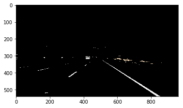
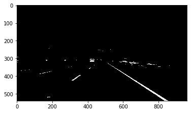
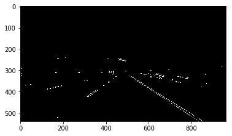
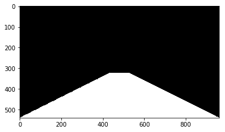
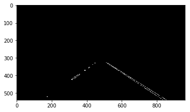
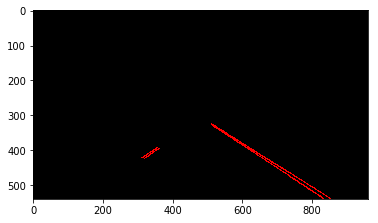
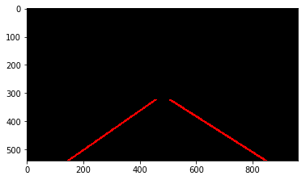
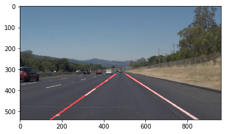
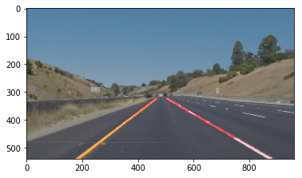

# Self-Driving Car Engineer Nanodegree


## Project: **Finding Lane Lines on the Road** 
***
In this project, I used **Python** and **OpenCV** to identify lane lines on the road.  I developed my pipeline on a series of individual images, and later applied the result to a video stream (really just a series of images).

---

**The tools I used are :**
* Color selection
* Region of interest selection
* grayscaling
* Gaussian smoothing
* Canny Edge Detection
* Hough Tranform
* Linear Interpolation / Extrapolation

**Run the cell below to import some packages.  If you get an `import error` for a package you've already installed, try changing your kernel (select the Kernel menu above --> Change Kernel).  Still have problems?  Try relaunching Jupyter Notebook from the terminal prompt.  Also, consult the forums for more troubleshooting tips.**  

## Import Packages
make sure to import the following packages as they are needed in the processing pipeline


```python
import matplotlib.pyplot as plt
import matplotlib.image as mpimg
import numpy as np
import cv2
import math
import os
from moviepy.editor import VideoFileClip
from IPython.display import HTML
%matplotlib inline
```

## Read in an Image
Now let's try to load a sample image


```python
#reading in an image
image = mpimg.imread('test_images/solidWhiteRight.jpg')

#printing out some stats and plotting
print('This image is:', type(image), 'with dimensions:', image.shape)
plt.imshow(image)  # if you wanted to show a single color channel image called 'gray', for example, call as plt.imshow(gray, cmap='gray')
```

    This image is: <class 'numpy.ndarray'> with dimensions: (540, 960, 3)
    


    <matplotlib.image.AxesImage at 0x20d1fe4b278>


# Lane Detection Pipeline (Explained)

## Color Selection
This function masks out image pixels where color values is greater that the threshold


```python
def color_select(image,red_threshold,green_threshold,blue_threshold):
    filtered_image = np.copy(image)
    rgb_threshold = [red_threshold, green_threshold, blue_threshold]
    thresholds = (image[:, :, 0] < rgb_threshold[0]) \
                 | (image[:, :, 1] < rgb_threshold[1]) \
                 | (image[:, :, 2] < rgb_threshold[2])
    filtered_image[thresholds] = [0, 0, 0]

    return filtered_image
```

Run the cell bellow to see a test result for this function


```python
color_filtered = color_select(image,190,190,10)
plt.imshow(color_filtered)
```


    <matplotlib.image.AxesImage at 0x20d1fef6470>





## Gray Scale
Now as we have an image filtered for Yellow and White colors only. We can gray scale it using the following function.


```python
def grayscale(img):
    """Applies the Grayscale transform
    This will return an image with only one color channel
    but NOTE: to see the returned image as grayscale
    (assuming your grayscaled image is called 'gray')
    you should call plt.imshow(gray, cmap='gray')"""
    return cv2.cvtColor(img, cv2.COLOR_RGB2GRAY)
```

Lets now test this Function


```python
gray = grayscale(color_filtered)
plt.imshow(gray, cmap='gray')
```


    <matplotlib.image.AxesImage at 0x20d1ffa3470>





## Gaussian Bluring
Now let's apply some Gaussion Bluring to our image using the following function


```python
def gaussian_blur(img, kernel_size):
    """Applies a Gaussian Noise kernel"""
    return cv2.GaussianBlur(img, (kernel_size, kernel_size), 0)
```

And let's check what we have got


```python
blur_gray = gaussian_blur(gray, 5)
plt.imshow(gray, cmap='gray')
```


    <matplotlib.image.AxesImage at 0x20d20006a90>


## Canny Edge Detection
So far we have :
* selected parts of the image that have While or Yellow colors
* Gray scaled the image to get only one color channel
* Applied Gaussian Blur to the image to reduce the noise in the image

Now let's apply the edge detection to our image. For that we use Canny Filter.


```python
def canny(img, low_threshold, high_threshold):
    """Applies the Canny transform"""
    return cv2.Canny(img, low_threshold, high_threshold)
```

Using this function our result should look like the following


```python
edges = canny(blur_gray, 50, 150)
plt.imshow(edges, cmap='gray')
```


    <matplotlib.image.AxesImage at 0x20d20897d68>





## Region of Interest
As lane line are located in the lower part of the image we can mask to upper part to remove the unwanted edges.
there are also some edges detected from other lanes in the image. We should also remove them.

That's why appling a region of interest filter is a good idea


```python
def region_of_interest(img, vertices):
    """
    Applies an image mask.
    
    Only keeps the region of the image defined by the polygon
    formed from `vertices`. The rest of the image is set to black.
    """
    #defining a blank mask to start with
    mask = np.zeros_like(img)   
    
    #defining a 3 channel or 1 channel color to fill the mask with depending on the input image
    if len(img.shape) > 2:
        channel_count = img.shape[2]  # i.e. 3 or 4 depending on your image
        ignore_mask_color = (255,) * channel_count
    else:
        ignore_mask_color = 255
        
    #filling pixels inside the polygon defined by "vertices" with the fill color    
    cv2.fillPoly(mask, vertices, ignore_mask_color)
    
    #returning the image only where mask pixels are nonzero
    masked_image = cv2.bitwise_and(img, mask)
    return masked_image
```

I used the following ROI Mask


```python
ysize = image.shape[0]
xsize = image.shape[1]
mask = np.zeros_like(edges)
vertices = np.array([[[xsize / 2 - 50, 0.6 * ysize], [xsize / 2 + 50, 0.6 * ysize], [xsize, ysize], [0, ysize]]], dtype=np.int32)
cv2.fillPoly(mask, vertices, 255)

plt.imshow(mask, cmap='gray')
```


    <matplotlib.image.AxesImage at 0x20d208fa2e8>





Using the Region of Interest function with this mask gives us the following results


```python
vertices = np.array([[[xsize / 2 - 50, 0.6 * ysize], [xsize / 2 + 50, 0.6 * ysize], [xsize, ysize], [0, ysize]]], dtype=np.int32)
masked_edges = region_of_interest(edges, vertices)

plt.imshow(masked_edges, cmap='gray')
```


    <matplotlib.image.AxesImage at 0x20d20958fd0>





## Hough Transform
As we have detected our Edge points. Let's find line segments that we can get from these point. That's why we apply Hough Transform.

Bellow is a list of supporting function that are used in our Hough Transform method


```python
def draw_lineSegments(lines,img):
    if lines is None:
        return 
    for line in lines:
        if line is None:
            continue

        for x1, y1, x2, y2 in line:
            if x2 == x1 or y2 == y1:  # vertical or horizontal lines
                continue

            cv2.line(img, (x1,y1), (x2,y2), [255, 0, 0], 2)

def get_line_points(line,sample_y1, sample_y2):
    """ Convert a line represented by slope and intercept into points """
    if line is None:
        return None

    slope, intercept = line

    # convert to int to be used as pixel points
    x1 = int((sample_y1 - intercept) / slope)
    x2 = int((sample_y2 - intercept) / slope)
    y1 = int(sample_y1)
    y2 = int(sample_y2)

    return ((x1, y1), (x2, y2))

def average_lane_lines(lines,y_low,y_high):
    left_lines = []  # (slope, intercept)
    left_weights = []  # (length,)
    right_lines = []  # (slope, intercept)
    right_weights = []  # (length,)
    if lines is None:
        return None,None
    for line in lines:
        if line is None:
            continue
        for x1, y1, x2, y2 in line:

            if x2 == x1 or y2 == y1:  # vertical or horizontal lines
                continue

            slope = np.float32((y2 - y1)) / np.float32((x2 - x1))
            intercept = y1 - slope * x1
            length = np.sqrt((y2 - y1) ** 2 + (x2 - x1) ** 2)

            if slope < 0:  # y is reversed in image
                left_lines.append((slope, intercept))
                left_weights.append((length))
            else:
                right_lines.append((slope, intercept))
                right_weights.append((length))

    # add more weight to longer lines
    left_lane_slope_intercept = np.dot(left_weights, left_lines) / np.sum(left_weights) if len(left_weights) > 0 else None
    right_lane_slope_intercept = np.dot(right_weights, right_lines) / np.sum(right_weights) if len(right_weights) > 0 else None

    left_lane_points = get_line_points(left_lane_slope_intercept,y_low,y_high)
    right_lane_points = get_line_points(right_lane_slope_intercept, y_low, y_high)
    return left_lane_points, right_lane_points

def draw_lines(img, lines, color=[255, 0, 0], thickness=5,draw_line_segments = False):
    """
    This function draws `lines` with `color` and `thickness`.
    Lines are drawn on the image inplace (mutates the image).
    """
    image_height = img.shape[0]

    if draw_line_segments is True:
        draw_lineSegments(lines, img)
    else:
        left_line, right_line = average_lane_lines(lines,0.6*image_height,image_height)

        if not (left_line is None):
            l_x1x1, l_x2y2 = left_line
            cv2.line(img, l_x1x1, l_x2y2, color, thickness)
        if not (right_line is None):
            r_x1x1, r_x2y2 = right_line
            cv2.line(img, r_x1x1, r_x2y2, color, thickness)

```

Our Hough Transfor function is as follows


```python
def hough_lines(img, rho, theta, threshold, min_line_len, max_line_gap,drawlineSegments = False):
    """
    `img` should be the output of a Canny transform.

    Returns an image with hough lines drawn.
    """
    lines = cv2.HoughLinesP(img, rho, theta, threshold, np.array([]), minLineLength=min_line_len, maxLineGap=max_line_gap)
    
    line_img = np.zeros((img.shape[0], img.shape[1], 3), dtype=np.uint8)
    draw_lines(line_img, lines,draw_line_segments = drawlineSegments)
    return line_img
```

Line segments will look like this


```python
line_image = hough_lines(masked_edges, 1, np.pi / 180, 20, 15, 4,True)
plt.imshow(line_image)
```


    <matplotlib.image.AxesImage at 0x20d20b5b8d0>





Interpolated lined will look like this


```python
line_image = hough_lines(masked_edges, 1, np.pi / 180, 20, 15, 4,False)
plt.imshow(line_image)
```


    <matplotlib.image.AxesImage at 0x20d209f87b8>





## Final Step
Now as we have our lane lines Let's draw them on the Original Image


```python
color_image = image.copy()
# Draw the lines on the color image
overlayed = cv2.addWeighted(color_image, 0.8, line_image, 1, 0)

plt.imshow(overlayed)
```


    <matplotlib.image.AxesImage at 0x20d20a5aa90>





# Lane Detection Pipeline (summary)
The Final Lane Detection Pipeline for image looks like this


```python
def process_image(image):
    """ detect lane lines on the image and highlight it with red lines"""
    # Grab the x and y size of the image
    ysize = image.shape[0]
    xsize = image.shape[1]
    
    color_mask = color_select(image, 190, 190, 10)

    gray = grayscale(color_mask)
    blur_gray = gaussian_blur(gray, 5)
    edges = canny(blur_gray, 50, 150)
    vertices = np.array([[[xsize / 2 - 50, 0.6 * ysize], [xsize / 2 + 50, 0.6 * ysize], [xsize, ysize], [0, ysize]]],
                        dtype=np.int32)
    masked_edges = region_of_interest(edges, vertices)
    line_image = hough_lines(masked_edges, 1, np.pi / 180, 20, 15, 4)
    color_image = image.copy()
    # Draw the lines on the color image
    return cv2.addWeighted(color_image, 0.8, line_image, 1, 0)
```

## Test Images

Build your pipeline to work on the images in the directory "test_images"  
**You should make sure your pipeline works well on these images before you try the videos.**


```python
import os
image_list = os.listdir("test_images/")

for entry in image_list:
    image = mpimg.imread('test_images/' + entry)
    output_image = process_image(image)
    
    plt.imshow(output_image)
```





## Build a Lane Finding Pipeline


Build the pipeline and run your solution on all test_images. Save output into the `test_images_output` directory.


```python
# Will draw lane lines on the test_images then save them to the test_images directory.
image_list = os.listdir("test_images/")

for entry in image_list:
    image = mpimg.imread('test_images/' + entry)
    output_image = process_image(image)
    mpimg.imsave("test_images_output/" + entry, output_image)
```

## Test on Videos

You know what's cooler than drawing lanes over images? Drawing lanes over video!

We can test our solution on two provided videos:

`solidWhiteRight.mp4`

`solidYellowLeft.mp4`

**Note: if you get an import error when you run the next cell, try changing your kernel (select the Kernel menu above --> Change Kernel). Still have problems? Try relaunching Jupyter Notebook from the terminal prompt. Also, consult the forums for more troubleshooting tips.**

**If you get an error that looks like this:**
```
NeedDownloadError: Need ffmpeg exe. 
You can download it by calling: 
imageio.plugins.ffmpeg.download()
```
**Follow the instructions in the error message and check out [this forum post](https://discussions.udacity.com/t/project-error-of-test-on-videos/274082) for more troubleshooting tips across operating systems.**

Let's try the one with the solid white lane on the right first ...


```python
white_output = 'test_videos_output/solidWhiteRight.mp4'

clip1 = VideoFileClip("test_videos/solidWhiteRight.mp4")
white_clip = clip1.fl_image(process_image)
%time white_clip.write_videofile(white_output, audio=False)
```

    [MoviePy] >>>> Building video test_videos_output/solidWhiteRight.mp4
    [MoviePy] Writing video test_videos_output/solidWhiteRight.mp4
    

    100%|███████████████████████████████████████████████████████████████████████████████▋| 221/222 [00:06<00:00, 32.15it/s]
    

    [MoviePy] Done.
    [MoviePy] >>>> Video ready: test_videos_output/solidWhiteRight.mp4 
    
    Wall time: 7.23 s
    

Play the video inline, or if you prefer find the video in your filesystem (should be in the same directory) and play it in your video player of choice.


```python
HTML("""
<video width="960" height="540" controls>
  <source src="{0}">
</video>
""".format(white_output))
```


<video width="960" height="540" controls>
  <source src="test_videos_output/solidWhiteRight.mp4">
</video>


Now for the one with the solid yellow lane on the left. This one's more tricky!


```python
yellow_output = 'test_videos_output/solidYellowLeft.mp4'

clip2 = VideoFileClip('test_videos/solidYellowLeft.mp4')
yellow_clip = clip2.fl_image(process_image)
%time yellow_clip.write_videofile(yellow_output, audio=False)
```

    [MoviePy] >>>> Building video test_videos_output/solidYellowLeft.mp4
    [MoviePy] Writing video test_videos_output/solidYellowLeft.mp4
    

    100%|███████████████████████████████████████████████████████████████████████████████▉| 681/682 [00:22<00:00, 32.47it/s]
    

    [MoviePy] Done.
    [MoviePy] >>>> Video ready: test_videos_output/solidYellowLeft.mp4 
    
    Wall time: 22.5 s
    


```python
HTML("""
<video width="960" height="540" controls>
  <source src="{0}">
</video>
""".format(yellow_output))
```


<video width="960" height="540" controls>
  <source src="test_videos_output/solidYellowLeft.mp4">
</video>


## Final Test

Try your lane finding pipeline on the video below.  Does it still work?


```python
challenge_output = 'test_videos_output/challenge.mp4'

clip3 = VideoFileClip('test_videos/challenge.mp4')
challenge_clip = clip3.fl_image(process_image)
%time challenge_clip.write_videofile(challenge_output, audio=False)
```

    [MoviePy] >>>> Building video test_videos_output/challenge.mp4
    [MoviePy] Writing video test_videos_output/challenge.mp4
    

    100%|████████████████████████████████████████████████████████████████████████████████| 251/251 [00:14<00:00, 17.68it/s]
    

    [MoviePy] Done.
    [MoviePy] >>>> Video ready: test_videos_output/challenge.mp4 
    
    Wall time: 14.9 s
    


```python
HTML("""
<video width="960" height="540" controls>
  <source src="{0}">
</video>
""".format(challenge_output))
```


<video width="960" height="540" controls>
  <source src="test_videos_output/challenge.mp4">
</video>


# Conclusion

The project was successful in that the video images clearly show the lane lines are detected properly and lines are very smoothly handled.

It only detects the straight lane lines.  To handle curved lanes We'll need to use poly fitting for lane lines rather than fitting to straight lines.


```python

```
